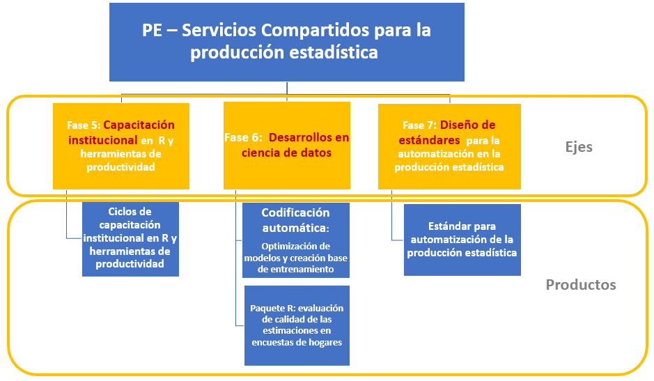
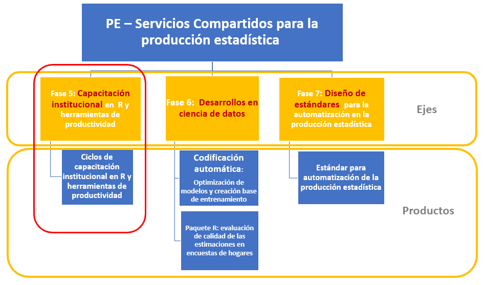
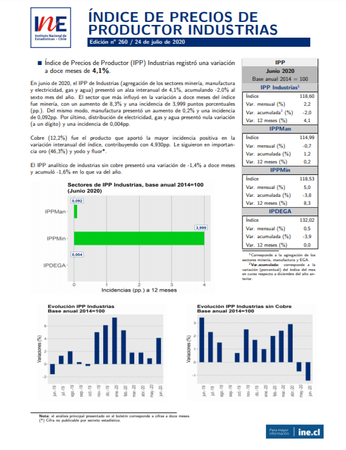
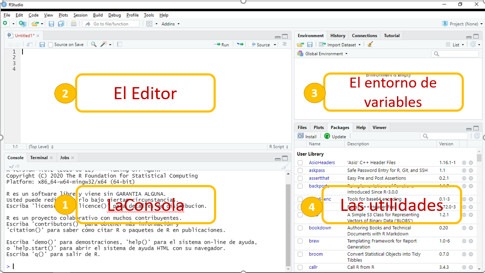
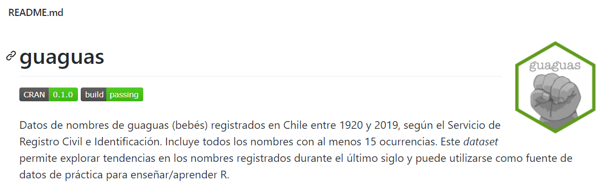

class: center, middle

.linea-superior[]
.linea-inferior[]


## Capacitación en R y herramientas de productividad

## Proyecto Estratégico Servicios Compartidos para la Producción Estadística

## Introducción y herramientas de exploración de datos

### Octubre 2020

```{r setup, include=FALSE}
options(htmltools.dir.version = TRUE)
knitr::opts_chunk$set(message = FALSE) 
```

```{r xaringan-themer, include=FALSE, warning=FALSE}
library(xaringanthemer)
#style_duo_accent(
 # primary_color = "#1381B0",
  #secondary_color = "#FF961C",
  #inverse_header_color = "#FFFFFF"
#)
```


---

background-image: url("imagenes/fondo2.PNG")
background-size: contain;
background-position: 100% 0%

# PE Servicios Compartidos

--

.medium-par[Esta actividad de capacitación se enmarca en el **PE SSCC**.]

--

.medium-par[El PE SSCC es uno de los 4 proyectos estratégicos actualmente en funcionamiento en el INE (2018-2022).]

--

.medium-par[Este proyecto busca:]

--

*"Proveer a la institución de estándares y desarrollos que permitan .red[automatizar], .red[estandarizar], .red[ordenar] e .red[innovar] en la producción estadística, permitiendo reducir .red[tiempos] y .red[costos] del procesamiento y análisis de las diferentes operaciones estadísticas del INE y minimizando la probabilidad de .red[errores] en la publicación de resultados".* 

---

background-image: url("imagenes/fondo2.PNG")
background-size: contain;
background-position: 100% 0%

# Estructura PE SSCC



---

background-image: url("imagenes/fondo2.PNG")
background-size: contain;
background-position: 100% 0%

# Estructura PE SSCC



---
background-image: url("imagenes/fondo2.PNG")
background-size: contain;
background-position: 100% 0%

# Objetivos del aprendizaje

--

.medium-par[Al finalizar la capacitación se espera que las/os participantes:]

--

- **Estén familiarizados con el lenguaje de programación R** y cuenten con las habilidades necesarias para **profundizar aspectos de su interés** en este lenguaje.

--

- Sean capaces de **explorar** y **transformar** objetos en R.

--

- Manejen herramientas de **visualización** en R.

--

- Aprendan **buenas prácticas de escritura de código** en R.

--

- Conozcan **recomendaciones** que les permitan hacer **reproducibles** y **trazables** sus rutinas en R. 

---

background-image: url("imagenes/fondo2.PNG")
background-size: contain;
background-position: 100% 0%

# Organización de la capacitación

--
<br/>

- La capacitación de nivel básico se compone de **5 sesiones**.

--

- Las sesiones de realizarán **semanalmente**, los días **miércoles entre 10:00 y 13:00 hrs** (a excepción de esta).

--

- Haremos una pausa de 10 minutos durante la sesión, en un momento a convenir.

--

- Si van surgiendo dudas, pueden consultar durante la clase levantando la mano ✋.

--

- Si tienen .pur[dudas que no apuntan directamente al contenido que se está revisando], podemos quedarnos unos minutos al término de la clase para resolverlas, o bien .pur[nos pueden consultar durante la semana].

---

background-image: url("imagenes/fondo2.PNG")
background-size: contain;
background-position: 100% 0%

# Organización de la capacitación

--
<br/>

- Compartiremos cada presentación antes del inicio de la sesión. Si existen correcciones detectadas, actualizaremos el repositorio durante la semana posterior.

--

- Al finalizar cada sesión se les presentará un desafío para resolver durante la semana 🏠. **Estos desafíos no tienen impacto en la evaluación del curso** y .pur[Pueden ser desarrollados en forma individual o en grupos de 2 o 3 personas]. 

--

- El plazo para la entrega de estos desafíos es el **día antes de la siguente sesión de capacitación, a las 12:00 hrs**. En ese momento se subirá a nuestro canal en Teams la solución a los ejercicios. 

--

- El objetivo de pedirles los *scripts* es permitirnos .pur[conocer sus avances], .pur[reforzar contenidos] y .pur[retroalimentarlas/os] de considerarse pertinente.

--

- 🎥 Las clases serán grabadas para que puedan consultarlas en el futuro. **Se les solicitará consentimiento para realizar esta grabación antes de comenzar cada clase**.

---

background-image: url("imagenes/fondo2.PNG")
background-size: contain;
background-position: 100% 0%

# Asistencia y evaluación del curso

--

## Asistencia

--

- Se requerirá una **asistencia mínima al 80%** de las sesiones de capacitación.

--

- Se permitirá justificar inasistencias por uso de permiso administrativo, feriado legal o por motivos laborales, **lo cual deberá ser informado por la jefatura del subdepartamento** al que la/el participante pertenece.

--

## Evaluación del curso

--

- Las/os participantes deberán realizar una **tarea final**.

--

- Deben obtener una calificación mínima de 4 (en una escala de 1 a 7).

--

- Al igual que los desafíos semanales, esta tarea .pur[puede ser desarrollada en forma individual o en grupos de 2 o 3 personas].

---

background-image: url("imagenes/fondo2.PNG")
background-size: contain;
background-position: 100% 0%

# Contenidos de la capacitación

.medium-par[**Parte I: Herramientas básicas**]

--

**Sesión 1:** Introducción y herramientas de exploración de datos

    - ¿Qué es R y por qué usarlo?
    - La interfaz de R Studio
    - Tipos de datos y operaciones básicas
    - Exploración y manipulación básica de un data frame

--

**Sesión 2:** Procesamiento de bases de datos (1)

    - Importación de datos desde distintos formatos a R
    - Introducción a dplyr
    - Manipulación básica de columnas (select(), rename())
    - Manipulación básica de filas (arrange(), filter())
    - Herramientas básicas de edición de datos (if_else())

---

background-image: url("imagenes/fondo2.PNG")
background-size: contain;
background-position: 100% 0%

# Contenidos de la capacitación

--
</br>

**Sesión 3:** Procesamiento de bases de datos (2)

    - Herramientas básicas de edición de datos (mutate())
    - Funciones de agrupación (group_by(), summarise())
    - Tidy data (pivor_longer(), pivot_wider())

--

**Sesión 4:** Procesamiento de bases de datos (3)

    - Unión de bases de datos (joins, binds)
    - Manejo de variables de tiempo (fechas)

--

**Sesión 5:** Visualización de datos usando el paquete ggplot2

    - Visualizar para comunicar efectivamente
    - La gramática de los gráficos: visualizar datos con ggplot2  

---

class: center, middle

.linea-superior[]
.linea-inferior[]


.big-par[Antes de comenzar]

--

.big-par[¿Qué saben de R?]

.big-par[🤓]

---

background-image: url("imagenes/fondo2.PNG")
background-size: contain;
background-position: 100% 0%

# ¿Qué es R y por qué usarlo?

--
<br/>

**R** es un lenguaje de programación creado por dos profesores de estadística de la Universidad de Auckland en 1993 (**Robert Gentleman y Ross Ihaka**).

--

**R** es gratis, su código es abierto y **se encuentra disponible en la mayoría de las plataformas** (Windows, Mac OS, Linux).

--

**¡Es muy versátil!** Hoy es utilizado para abordar problemas de **distintas disciplinas**, sobre todo de estadística.

--

Posiblemente las **técnicas o metodologías más recientes tengan alguna aplicación en R**. Los investigadores muchas veces publican un paquete del programa en compañía de sus artículos.

--

**Su lenguaje esta hecho para el análisis de datos**.

---

background-image: url("imagenes/fondo2.PNG")
background-size: contain;
background-position: 100% 0%

# ¿Qué es R y por qué usarlo?

--

.medium-par[¡Su comunidad de usuarios es muy activa!]

--

Se puede contectar con una comunidad local y global de usuarios a traves de **grupos de usurios**, twitter . Además se puede obtener ayuda de expertos utilizando [stackoverflow](https://stackoverflow.com/questions/tagged/r).

--

En Chile la comunidad de R se ha organizado en torno al [Grupo de Usuarios de R en Chile](https://www.meetup.com/es-ES/useRchile/) y R-Ladies con capítulos en [Santiago](https://www.meetup.com/rladies-scl/), [Valparaíso](https://www.meetup.com/rladies-valparaiso/), [Concepción](https://www.meetup.com/es-ES/rladies-concepcion/) y [Talca](https://www.meetup.com/es-ES/rladies-talca/).

--

Anaualmente se realizan conferencias de a nivel mundial [UseR!](https://user2020.r-project.org/) y a nivel latinoamericano [Latin-R](http://latin-r.com).

--

Cuenta con **poderosas herramientas para comunicar resultados**. Varios paquetes en **R** facilitan la creación de reportes en pdf o en html, así como también para la creación de web interactivas.

--

Cuenta con un **entorno de desarrollo interactivo** diseñado especialmente para el análisis de datos y la programación estadística (**RStudio**).

--

Varias de estas razones se encuentran en: [Wickham, 2014](http://adv-r.had.co.nz/Introduction.html)

---

background-image: url("imagenes/fondo2.PNG")
background-size: contain;
background-position: 100% 0%

# ¿Qué cosas podemos hacer en R?

--

.pull-left[]

--

.pull-right[]

---

background-image: url("imagenes/fondo2.PNG")
background-size: contain;
background-position: 100% 0%

# ¿Qué cosas podemos hacer en R?

--

.medium-par[**Boletín índice de Precios al Productor (IPP):**]

--

.center[]

---

background-image: url("imagenes/fondo2.PNG")
background-size: contain;
background-position: 100% 0%

# ¿Qué cosas podemos hacer en R?

--

.medium-par[**Boletines en Direcciones Regionales:**]

--

[Boletín EMAT de la Dirección Regional de Ñuble](https://regiones.ine.cl/documentos/default-source/region-xvi/estadisticas-r16/1.-boletines-informativos/emat/2020/bolet%c3%adn-emat-%c3%b1uble_junio_2020.pdf?sfvrsn=d3efa129_4)

--

.medium-par[**Documentos metodológicos EPF:**]

--

- [Cálculo de medidas de precisión para medianas de ingreso y gasto de la VIII EPF](https://www.ine.cl/docs/default-source/documentos-de-trabajo/c%C3%A1lculo-de-medidas-de-precisi%C3%B3n-para-medianas-de-ingreso-y-gasto-de-la-v.pdf?sfvrsn=e5b6a7b3_2)

--

- [Reclasificación de la no respuesta: distinción entre la no respuesta al ítem y la no respuesta a l unidad](https://www.ine.cl/docs/default-source/documentos-de-trabajo/190320-documento-reclasificacion-de-la-no-respuesta-viii-epf.pdf?sfvrsn=e680d877_2)

--

- [Métodos de Imputación VIII EPF: Gastos diarios e ingresos de la actividad laboral y jubilaciones](https://www.ine.cl/docs/default-source/documentos-de-trabajo/190320-documento-imputacion-viii-epf.pdf?sfvrsn=668a66c0_2)

--

.center[.medium-par[**Esta presentación está desarrollada completamente en R** 🤯🤯]]

---

class: center, middle

.linea-superior[]
.linea-inferior[]


.big-par[Ahora abramos RStudio]


---

background-image: url("imagenes/fondo2.PNG")
background-size: contain;
background-position: 100% 0%

# Interactuando con R

--

.center[.medium-par-red[La interfaz de RStudio está distribuida de la siguiente manera]]

--




---

background-image: url("imagenes/fondo2.PNG")
background-size: contain;
background-position: 100% 0%

# Interactuando con R

--

.medium-par[Existen dos formas principales de interactuar con **R**:]

--

- .medium-par[A través de la consola.]

--

- .medium-par[Usando archivos *script* (texto plano que contiene nuestro código).]

---

background-image: url("imagenes/fondo2.PNG")
background-size: contain;
background-position: 100% 0%

# Interactuando con R

--

## Consola

--

En **RStudio** corresponde al panel ubicado abajo a la izquierda. 

--

El símbolo `>` significa que **R** está listo para que le entreguemos una instrucción a ejecutar.

--

En esta ventana también aparecen los **resultados** de las instrucciones.

--

Los comandos que se escriban aquí **no serán grabados** para un nuevo inicio de sesión.

--

El código escrito en consola se ejecuta con la tecla **Enter**.
  
--

.medium-par-red[Sin embargo, **una práctica habitual y recomendada** es guardar rutinas completas en archivos *script*.]
  
---

background-image: url("imagenes/fondo2.PNG")
background-size: contain;
background-position: 100% 0%

# Interactuando con R

## *Script*

--

Es común que una tarea la queramos **repetir** más de una vez.

--

Esta tarea muchas veces involucra un conjunto de tareas, por lo que es **poco eficiente utilizar la consola** para realizarlas.

--

Resulta conveniente guardar múltiples instrucciones en un archivo de texto (*script*) que luego nos permita **volver a ejecutar** estas tareas.

--

Además resulta mucho **más fácil compartir** nuestro trabajo de esta manera.

--

Para ejecutar el código en *script* puedes utilizar el *shortcut* .pur[Ctrl + Enter].

--

👁️ Para comentar en el *script* se utiliza el signo gato** (#)**

--

El signo **#** también sirve para **silenciar** código sin tener que borrarlo.

--

👀 Con el *shortcut* .pur[Crtl +Shift + c] puedes **silenciar** varias lineas a la vez.

---

background-image: url("imagenes/fondo2.PNG")
background-size: contain;
background-position: 100% 0%

# Primeras operaciones en R

--

.medium-par[R puede ser usado como una calculadora.]

--

Pruébenlo ustedes mismos en su consola o script.

```{r}
4 + 5
```

```{r}
6 * 8
```

```{r}
(4 + 5) + (6 * 8)
```

--

Se pueden hacer cosas mucho más interesantes. Para eso es útil **asignar valores a objetos**

--

Para esto se utiliza el operador "**<-**" (shortcut **"Alt + -**") 

--

```{r}
x <- 5
```

---

background-image: url("imagenes/fondo2.PNG")
background-size: contain;
background-position: 100% 0%

# Primeras operaciones en R

--

Entonces, podríamos hacer cosas como esta.

--

```{r}
a <- 20
b <- 5

a + b
```

--

El signo "**^**" representa al exponencial. También se puede usar "******"

```{r}
a + b ^ 2
```

--

Entonces, podemos hacer operaciones sobre los valores almacenados, a través de estos objetos abstractos (a y b).


---

background-image: url("imagenes/fondo2.PNG")
background-size: contain;
background-position: 100% 0%

# Ejercicio express 1

--
<br/>

.medium-par[1- ¿Qué sucede si cambiamos el valor de "a" por 45 y volvemos a realizar la última operación?]

--

.medium-par[2- ¿Es posible asignar el resultado a una nueva variable "c"? **¿Cómo lo harían?**]

---

background-image: url("imagenes/fondo2.PNG")
background-size: contain;
background-position: 100% 0%

# Funciones en R

--

La mayor parte del tiempo, en cualquier *software*, usamos **funciones** integradas.

--

Pueden ser entendidas como *scripts* que funcionan "tras bambalinas": **un conjunto de instrucciones que permiten automatizar rutinas largas y/o complicadas**.

--

O también operaciones sencillas. Por ejemplo:

--

```{r}
3 + 3
```

--

Es lo mismo que utilizar la función `sum()`

```{r}
sum(3,3)
```

--

Pero `sum()` es una función muy versátil y más potente.

```{r}
x <- c(1,3,5,6,8,9,18,20)
sum(x)
```

---

background-image: url("imagenes/fondo2.PNG")
background-size: contain;
background-position: 100% 0%

# Funciones en R

## R contiene variadas funciones matemáticas

```{r}
sqrt(4) # raíz cuadrada
```

```{r}
round(9.556789) # aproximar
```


```{r}
floor(9.556789) # truncar
```

--

**Las funciones tienen argumentos**, y podemos consultarlos con la función `args()`

```{r}
args(round)
```

---

background-image: url("imagenes/fondo2.PNG")
background-size: contain;
background-position: 100% 0%

# Funciones en R

--

El argumento "digits" me permite indicarle a `round()` cuántos decimales quiero. **Pero si no le digo asume que es cero**.

```{r}
round(9.556789, digits = 2)
```

--

En este caso también puedo indicarlo de una manera más sencilla

--

```{r}
round(9.556789, 2)
```
--

Como no hay ambigüedad, R lo entiende.

--

Para obtener ayuda sobre una función lo hacemos de la siguiente forma:

```{r, eval = F}
?round
# o
help(round) # help también es una función
```

---

background-image: url("imagenes/fondo2.PNG")
background-size: contain;
background-position: 100% 0%

# Funciones en R

--

Gran parte de las funciones que utilizamos en R vienen contenidas en **paquetes** (*packages*).

--

Las funciones que acabamos de conocer pertenecen al paquete *base*, que viene con el *software* R.

--

.medium-par[Sin embargo, **existen más de 10.000 paquetes en R.**]

--

.medium-par[La mayoría creados por sus usuarios 🤯🤯]

--

Más adelante descargaremos y utilizaremos algunas librerías de R.

---

background-image: url("imagenes/fondo2.PNG")
background-size: contain;
background-position: 100% 0%

# Tipos de datos en R

--

Conoceremos algunos de los tipos de datos más utilizados.

--

## Vectores

--

Es el objeto más básico en **R**.

--

Un vector es una forma de **almacenar datos** que permite contener **una serie de valores del mismo tipo**.

--

Veamos algunos ejemplos. 

--

```{r, eval = T}
nombres <- c("hans", "claudia", "sara", "pablo")
a <- c(1, 5, 6, 9:12)
b <- c(1, 2, 3, "gato")
```

--

La función "c" (combine) permite unir valores u objetos.

--

- ¿cuántos elementos contiene el vector "a"?


- ¿De qué tipo son los vectores creados?

--

(con la función `length()` pueden contar los elementos de un vector)

---

background-image: url("imagenes/fondo2.PNG")
background-size: contain;
background-position: 100% 0%

# Tipos de datos en R

--

Existen 5 tipos de vectores en R:

--

```{r}
character <- c("gato", "perro")
numeric <- c(8, 15.9) # reales o decimales
integer <-  c(2L, 4L) # L indica que son enteros
logical <- c(TRUE, FALSE, TRUE) 
complex <- 3 + 4i # complejos
```

--

Podemos consultar cuál es el tipo de vector con `class()` o `typeof()`


```{r}
class(a)
typeof(b)
```

--

.medium-par[Que los vectores sea atómicos ⚛️ significa que .medium-par-red[solo pueden contener un tipo de datos.]]

---

background-image: url("imagenes/fondo2.PNG")
background-size: contain;
background-position: 100% 0%

# Tipos de datos en R

## Creando vectores

--

Vimos que es posible crear vectores con la función "c".

```{r}
x <-c(1,2,3,4,5)
```

--

Una secuencia sencilla también podemos crearla de la siguiente manera.

```{r}
y <- 1:20
y
```

---

background-image: url("imagenes/fondo2.PNG")
background-size: contain;
background-position: 100% 0%

# Tipos de datos en R

## Creando vectores

Sin embargo, existen funciones más poderosas para crear vectores.

--

Una de ellas es `seq()`(*sequence generation*).

--

Recibe 4 argumentos: *from*, *to*, *length* y *by*.

--

.medium-par-red[¿Cómo crearían un vector que vaya del 1 al 5 y que avance en intervalos de 0.5?]

--

```{r, eval = F}
a <- seq(from = ¿?, to = ¿?, by = ¿?)
```

--

.medium-par-red[¿Cómo crearían un vector que vaya del 1 al 10 y contenga 100 valores?]


```{r, eval = F}
b <- seq(from = ¿?, to = ¿?, length = ¿?)
```

--

Sin especificarlo, **R** genera intervalos de igual tamaño.

---

background-image: url("imagenes/fondo2.PNG")
background-size: contain;
background-position: 100% 0%

# Tipos de datos en R

## Operaciones matemáticas

--

R ofrece los siguientes operadores matemáticos

--

```{r, eval = F}
x + y   # suma
x - y   # resta
x * y   # multiplicación
x / y   # división
x ^ y   # exponenciación
x %% y  # modulo división (resto) 10 %% 3 = 1 
x %/% y # división por enteros: 10 %/% 3 = 3
```

--

Generalmente utilizamos los operadores básicos (+, -, *, /).

--

Sin embargo, el operador **módulo (%%)** es muy útil para programar.

---

background-image: url("imagenes/fondo2.PNG")
background-size: contain;
background-position: 100% 0%

# Tipos de datos en R

## Indexación

--

En general, cuando trabajamos con datos ordenados **nos interesa seleccionar uno o algunos elementos en particular**.

--

```{r}
bandas_cl <- c("Los prisioneros", "Los Bunkers", 
               "Los Ángeles Negros") 
bandas_arg <- c("Pescado rabioso", "Spinetta Jade", 
                "Virus", "Soda Stereo")
bandas <- c(bandas_cl, bandas_arg) # acá uno los dos vectores
bandas
```

--

Al imprimir el vector bandas vemos que aparece un número entre [ ]


---

background-image: url("imagenes/fondo2.PNG")
background-size: contain;
background-position: 100% 0%

# Tipos de datos en R

## Indexación

--

Este número indica un **índice o posición** de los elementos al interior de un vector.

--

```{r}
bandas[5] # nos entrega el 5to elemento
```

--

La **indexación es la selección de subconjuntos de datos de un vector**. .pur[[]] es un operador de selección.

--

Tenemos .pur[diferentes alternativas para indicar posición]. Veamos ejemplos:

--


```{r}
# primero creamos vectores
numeros <- 20:40 
nombres <- c("hans", "claudia", "sara", "pablo")
```

--

- Con un operador lógico 

```{r}
numeros[numeros>30]
```

---

background-image: url("imagenes/fondo2.PNG")
background-size: contain;
background-position: 100% 0%

# Tipos de datos en R

## Indexación

--

- Con un vector numérico

```{r}
numeros[8]
nombres[c(1,2)]
```
--

- Con selección negativa (ej. vector[-1])

```{r}
nombres[-2]
nombres[c(-3,-4)]
```
---

background-image: url("imagenes/fondo2.PNG")
background-size: contain;
background-position: 100% 0%

--

# Ejercicio express 2


--

1. Crea un vector numérico del 1 al 30 y asígnalo a un objeto (ponle el nombre que quieras).

--

2. Selecciona el valor de la quinta posición.

--

3. Selecciona los valores mayores a 13.

--

4. Crea un segundo objeto a partir del primero que no contenga el último valor (30).

--

5. Crea un tercer vector que vaya del 0 al 30, pero .pur[que contenga solo los números pares].

--

.center[.medium-par-red[Recuerda que para crear objetos o asignar valores debes usar ** <-**]]


---

background-image: url("imagenes/fondo2.PNG")
background-size: contain;
background-position: 100% 0%

# Operadores lógicos

.medium.par[Los **operadores lógicos** son .medium-par-red[muy] importantes para la programación.]

--

**R** cuenta con operadores de comparación binaria.

```{r, echo=TRUE, eval=FALSE}
x < y    # menor que
x > y    # mayor que
x <= y   # menor o igual que
x >= y   # mayor o igual que
x == y   # igual a 
x != y   # distinto a
```

--

👀: Nota que `==` permite comparar si dos valores son iguales. Ten cuidado de **NO** usar `=` que es interpretado como un operador de asignación (es como usar **<-**).

---

background-image: url("imagenes/fondo2.PNG")
background-size: contain;
background-position: 100% 0%

# Operadores lógicos

--

Algunos ejemplos con números:

```{r, echo=TRUE, eval=FALSE}
x <- c(1,2,5)
y <- c(4,4,3)
x == y
#> [1] FALSE FALSE FALSE
x != y
#> [1] TRUE TRUE TRUE
x < y
#> [1]  TRUE  TRUE FALSE
```

--

Ahora con caracteres:

```{r, echo=TRUE, eval=FALSE}
a <- c("izzy", "jazz", "tyler")
b <- c("devon", "vanessa", "hilary")
a < b   # orden alfabético
#> [1] FALSE  TRUE FALSE
```

---

background-image: url("imagenes/fondo2.PNG")
background-size: contain;
background-position: 100% 0%

# Operadores lógicos

--

Comparaciones en **R** tienen como resultado valores lógicos: `TRUE`, `FALSE` o `NA` (*not available*). 

--

Tal como en los operadores aritméticos, las comparaciones lógicas con un vector son aplicadas **elemento a elemento** y su resultado es un vector de valores de verdad (vector lógico).

--

Los operadores lógicos son muy usados para **extraer** información que **cumple con ciertas condiciones** de determinado conjunto de datos. 

--

.medium-par[Otros operadores muy importantes son "`|`" (o) y "`&`" (y).]

--

**Revisaremos estos operadores más adelante.**

---

background-image: url("imagenes/fondo2.PNG")
background-size: contain;
background-position: 100% 0%

# Operadores lógicos

--

También podemos modificar elementos específicos de un vector.

--

```{r, echo=TRUE}
# primero creamos un vector
x <- 1:10
```

--

Podemos hacerlo indicando una posición 

```{r, echo=TRUE}
x[5] <- 0
x
```

--

O también podemos seleccionar los elementos a modificar con **operadores lógicos**.

--

.medium-par-red[¿Qué creen que hace esta sentencia?]

```{r}
x <- 1:10
x[x > 5] <- x[x > 5] + 5
```

---

background-image: url("imagenes/fondo2.PNG")
background-size: contain;
background-position: 100% 0%

# Otros tipos de datos en R

--

Existen estructuras de datos más complejas que los vectores.

--

## data frames

--

.pur[Es el formato más común al que nos enfrentamos diariamente] en hojas de cálculo, o programas como SPSS, Stata, etc.

--

Podemos entender un data frame como un .pur[conjunto de vectores que tienen la misma longitud] y que conforman una tabla (i.e. toman forma rectangular).

--

```{r}
curso <- data.frame(nombre = c("Klaus", "Juan", "Ignacio"),
                    notas = c(7, 7, 1))
curso
```

.medium-par-red[La mayor parte de este curso se enfocará en cómo trabajar con este tipo de objetos en R.]

---

background-image: url("imagenes/fondo2.PNG")
background-size: contain;
background-position: 100% 0%

# Otros tipos de datos en R


## Matrices

--

**Pueden ser entendidas como una extensión de los vectores**, pero con dimensión de filas y columnas.

--

.medium-par-red[No pueden convivir tipos de datos diferentes dentro de una matriz.]

```{r matrix, include=TRUE}
curso <- matrix(c("Klaus", "Juan", "Ignacio", 7, 7, 1),
                nrow = 3,
                ncol = 2)
colnames(curso) <- c("nombre", "nota")

curso
```

--

Si se fijan, los números fueron forzados a ser *character* ("1").


---

background-image: url("imagenes/fondo2.PNG")
background-size: contain;
background-position: 100% 0%

# Otros tipos de datos en R

## Listas

--

Una lista es una estructura que **puede contener diferentes tipos de datos**, incluso listas.

--

A veces se les llama vectores genéricos, dado que soportan cualquier tipo de formato.

--

```{r lista, echo=TRUE, eval=FALSE}
a <- c(1,2,3,4,5)
b <- c("rojo", "verde")
c <-  data.frame(nom = "Klaus", "Juan",
                          nota = 7, 7)

lista1 <- list(a,b,c)
```

--

.pur[Esta estructura es más compleja de entender], pero son .pur[muy útiles] cuando ya se tiene cierto manejo de `R`.

---

background-image: url("imagenes/fondo2.PNG")
background-size: contain;
background-position: 100% 0%

# Otros tipos de datos en R


## Factores

--

Son usados para representar **variables categóricas**, ordinales o no.

--

Parecen vectores de caracteres y a veces se comportan de esa manera (porque **permiten guardar etiquetas**), pero realmente son almacenados como *integers* (enteros, .pur[que son más livianos para almacenar]).

--

```{r factores, echo=TRUE}
ocupacion <- factor(x = c(1,2,3,1,2,1,3,4,1,5), 
       labels = c("profesor", "musico", "doctora",
                  "taxista", "pescador"))
ocupacion
```

--

En las sesiones posteriores veremos que son muy importantes, sobre todo cuando queremos .pur[visualizar] nuestros datos 📊📈.

---

background-image: url("imagenes/fondo2.PNG")
background-size: contain;
background-position: 100% 0%

# Otros tipos de datos en R

## *Arrays*

--

Finalmente, este tipo de datos es similar a las matrices, sin embargo, pueden tener más de dos dimensiones.

--

De hecho, .medium-par-red[un *array* de dos dimensiones es lo mismo que una matriz.]

--

**No las usaremos para nada en el curso** (pero pueden consultar más sobre ellas con `help(array)` 👀)

---

background-image: url("imagenes/fondo2.PNG")
background-size: contain;
background-position: 100% 0%

# Recapitulando

--

.medium.par[Hasta ahora hemos visto:]

--

- Qué es R y por qué usarlo

--

- Cosas que podemos hacer con R

--

- Interfaz de RStudio

--

- Primeras operaciones con R (funciones básicas, asignaciones, ...)

--

- Tipos de datos en R (vectores, matrices, *data frames*, ...) y...

--

- Operadores lógicos (>, <, ==, ...)


---

background-image: url("imagenes/fondo2.PNG")
background-size: contain;
background-position: 100% 0%

# Volviendo a los *data frames*

--

Como mencionamos anteriormente, los *data frames* **son la estructura de datos a la que nos enfrentamos más a menudo.**

--

Para explorar y manipular *data frames* utilizaremos el paquete `guaguas` de **Riva Quiroga (lingüista chilena).**

--



--

Instalamos el paquete (.pur[nuestro primer paquete 😍])

--

```{r, eval = F}
install.packages("guaguas")
```

---

background-image: url("imagenes/fondo2.PNG")
background-size: contain;
background-position: 100% 0%

# Volviendo a los *data frames*

--

Y luego lo cargamos en nuestra sesión (.pur[no basta con instalarlo para usarlo]).

--

```{r}
library(guaguas)
```

--

Es una base de .medium-par-red[alto interés sociológico]. 🧐

--

```{r, echo = F, warning=F, out.width = "700px", out.height="400px" , fig.align='center'}
library(guaguas)
library(dplyr)
library(stringr)
library(ggplot2)
library(forcats)
library(hrbrthemes)
library(ggthemes)

guaguas %>% 
  filter(nombre %in% c("Milenka", "Branco", "Salomé"), anio > 1980) %>% 
  ggplot(aes(anio, n, color = nombre)) + 
  geom_line() +
  scale_color_colorblind() +
  labs(x = "año", y = "total inscripciones",
       title = "Inscripciones de nombres de personajes\n de 'Romané'") +
  theme_ipsum()
```

---

background-image: url("imagenes/fondo2.PNG")
background-size: contain;
background-position: 100% 0%

# Volviendo a los *data frames*

--

```{r, echo = F, warning=F, out.width = "700px", out.height="400px" , fig.align='center'}
guaguas %>% 
  filter(nombre %in% c("Brian", "Kevin", "Bryan", "Brayan")) %>% 
  ggplot(aes(anio, n, color = fct_reorder2(nombre, anio, n))) +
  geom_line() +
  scale_color_colorblind() +
  labs(x = "año", y = "total inscripciones", color = "nombre",
       title = "El efecto 'Backstreet Boys'") +
  theme_ipsum()
```


---

background-image: url("imagenes/fondo2.PNG")
background-size: contain;
background-position: 100% 0%

# Exploración *data frames*

--

(fuente de paquete y gráficos:[GitHub de Riva Quiroga](https://github.com/rivaquiroga/guaguas))


--

R cuenta con algunas funciones *base* para la **exploración**.

--

Primero carguemos la base en nuestro **ambiente de trabajo**.

--

```{r}
data <- guaguas
```

--

Dado que la base viene con el paquete no es necesario cargarla, pero es mejor acostumbrarse de esta manera.

--

.medium-par-red[¿Qué información nos aportan estas funciones sobre nuestra base?]

--


```{r, eval=F}
class(data)
is.data.frame(data)
dim(data)
str(data)
head(data)
names(data)
```

---

background-image: url("imagenes/fondo2.PNG")
background-size: contain;
background-position: 100% 0%

# Exploración *data frames*

--

También usando lenguaje *base* podemos pedir tablas de resumen.

--

.medium-par-red[Para eso podemos utilizar la función `table()` y el operador "$", que vincula a una variable con un objeto.]

--

```{r, eval=F}
table(data$anio)
table(data$nombre)
```

--

También podemos pedir la proporción, aplicando aplicando `prop.table()` sobre `table()`.

--

```{r}
prop.table(table(data$sexo))
```


---

background-image: url("imagenes/fondo2.PNG")
background-size: contain;
background-position: 100% 0%

# Seleccionar filas y columnas 

--

Es similar a la seleción de elementos en un vector.

--

## Seleccionar columnas

--

Podemos seleccionar columnas por su posición.

--

```{r}
data_2 <- data[,1]
dim(data_2)
```

```{r}
data_3 <- data[,c(2:5)]
dim(data_3)
```

--

También podemos seleccionar por nombre de columna.

```{r}
data_4 <- data[,c("anio", "nombre", "n")]
names(data_4)
```

---

background-image: url("imagenes/fondo2.PNG")
background-size: contain;
background-position: 100% 0%

# Seleccionar filas y columnas 

--

## Seleccionar filas

--

Se pueden seleccionar filas de distintas maneras.

--

```{r}
data_5 <- data[data$anio==2019,]
table(data_5$anio)
```

--

```{r}
data_6 <- data[data$anio > 2010,]
table(data_6$anio)
```

--

Por supuesto, también se pueden seleccionar filas y columnas a la vez 🥳.

--

.medium-par-red[¿Cómo lo harían?] Hagamos algunos ejercicios para finalizar.

---

background-image: url("imagenes/fondo2.PNG")
background-size: contain;
background-position: 100% 0%

# Ordenar vectores y *data frames*

--

Antes vamos a instalar una librería más.

--

Esta librería la vamos a utilizar .medium-par-red[muchísimo] en las próximas sesiones.

--

```{r, eval = F}
install.packages("tidyverse")
```

--

Cargamos la librería.

--

```{r, message = F}
library(tidyverse)
```

--

En esta sesión vamos a conocer una función llamada `arrange()` que está contenida en `tidyverse`.

--

`arrange()` cumple la función de .medium-par-red[ordenar] vectores o *data frames* **en función de una o más variables.**

---

background-image: url("imagenes/fondo2.PNG")
background-size: contain;
background-position: 100% 0%

# Ordenar vectores y *data frames*

--

.medium-par[Funciona así:]

--

Asi podemos ordenar el *data frame* por `anio`. 

--

```{r, eval=F}
arrange(data, anio)
```

Por defecto lo hace de forma .medium-par-red[ascendente]. 

--

Le podemos pedir que lo haga en forma .medium-par-red[descendente]. 

--

Además **puede ordenarse por más de una variable**. 

--

```{r, eval = F}
arrange(data, desc(anio, n))
```

---

background-image: url("imagenes/fondo2.PNG")
background-size: contain;
background-position: 100% 0%

#  Tarea para la 🏠 

--

Con las herramientas para **seleccionar, filtrar y ordenar**, puedes hacerlo de .pur[distintas] maneras.

--

(1). ¿Cuántas personas .pur[con tu nombre] nacieron .pur[el mismo año que tú]?

--

**pista:** R es *case sensitive*, y los nombres tienen su primera letra mayúscula (p.e: "Camila").

--

(2). ¿Cuál fue el nombre más usado el año que tú naciste?

--


(3). .medium-par-red[bonus:] ¿Cuál es el nombre .medium-par-red[más usado] en Chile en todos los tiempos?

.center[.big-par[🧠]]


```{r, echo=F, include=F}
data %>% group_by(nombre) %>% 
  summarise(suma = sum(n)) %>%
  arrange(desc(suma))
```

---

background-image: url("imagenes/fondo2.PNG")
background-size: contain;
background-position: 100% 0%

# Referencias

.medium-par[Nada de esto sería posible sin:]

- [R for Data Science, de Hadley Wickham](https://r4ds.had.co.nz/)

- [Advanced R, de Hadley Wickham](http://adv-r.had.co.nz/Introduction.html)

- [Data wrangling, exploration, and analysis with R, de Jenny Bryan](http://stat545.com/index.html)

- [Introduction to R, de Data Carpentry](https://datacarpentry.org/R-genomics/01-intro-to-R.html#functions)

- [Xaringan: Presentation Ninja, de Yihui Xie](https://github.com/yihui/xaringan). Para generar esta presentación con la plantilla ninja ⚔

.medium-par[R for Data Science tiene una traducción al español realizada por la comunidad hispana de R:]

- [R para ciencia de datos, de Hadley Wickham](https://es.r4ds.hadley.nz/)

---

class: center, middle

.linea-superior[]
.linea-inferior[]


## Capacitación en R y herramientas de productividad

## Proyecto Estratégico Servicios Compartidos para la Producción Estadística

## Introducción y herramientas de exploración de datos

### Agosto 2020
